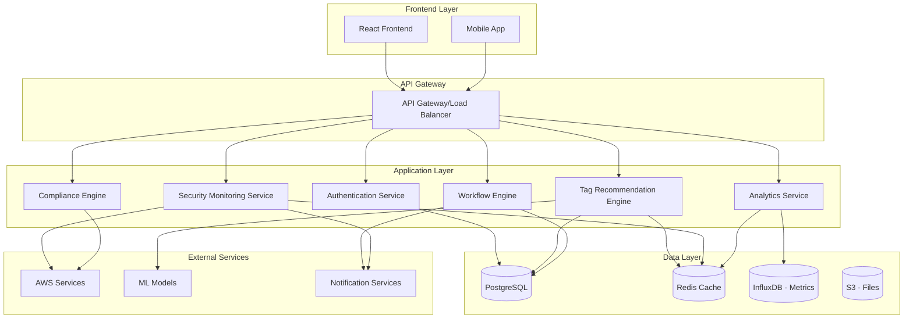

# 🏗️ Mond Architecture Overview

## 🌙 System Architecture

Mond follows a modern microservices architecture designed for scalability, security, and maintainability.



## 🧩 Core Components

### Frontend Layer
- **React Application**: Modern SPA with TypeScript
- **Mobile App**: React Native (future)
- **Design System**: Ant Design with custom theming

### Backend Services
- **API Gateway**: FastAPI with automatic OpenAPI documentation
- **Authentication**: JWT-based with AWS Identity Center integration
- **Tag Engine**: ML-powered recommendation system
- **Security Monitor**: Real-time security event processing
- **Compliance Engine**: Policy evaluation and reporting
- **Workflow Engine**: Approval and automation workflows
- **Analytics Service**: Metrics collection and analysis

### Data Storage
- **PostgreSQL**: Primary application data
- **Redis**: Caching and session storage
- **InfluxDB**: Time-series metrics and logs
- **S3**: File storage and backups

## 🔄 Data Flow

### Tag Recommendation Flow
1. User creates/modifies resource
2. Context extraction (resource type, existing tags, patterns)
3. ML model inference
4. Confidence scoring and ranking
5. Real-time recommendation delivery

### Security Monitoring Flow
1. AWS service events via CloudTrail/EventBridge
2. Event normalization and enrichment
3. Rule engine evaluation
4. Alert generation and routing
5. Dashboard updates and notifications

## 🛡️ Security Architecture

### Authentication & Authorization
- **Identity Provider**: AWS Identity Center (SSO)
- **Token Management**: JWT with refresh tokens
- **RBAC**: Role-based access control
- **API Security**: Rate limiting, input validation

### Data Security
- **Encryption at Rest**: AES-256 for databases
- **Encryption in Transit**: TLS 1.3 for all communications
- **Secrets Management**: AWS Secrets Manager
- **Audit Logging**: Comprehensive audit trail

## 📊 Scalability Design

### Horizontal Scaling
- **Stateless Services**: All services designed to be stateless
- **Load Balancing**: Application Load Balancer with health checks
- **Auto Scaling**: Kubernetes HPA based on CPU/memory/custom metrics
- **Database Scaling**: Read replicas and connection pooling

### Performance Optimization
- **Caching Strategy**: Multi-layer caching (Redis, CDN, browser)
- **Database Optimization**: Indexing, query optimization, partitioning
- **Async Processing**: Celery for background tasks
- **CDN**: CloudFront for static assets

## 🔧 Technology Stack

### Backend
```yaml
Framework: FastAPI (Python 3.9+)
Database: PostgreSQL 14+
Cache: Redis 7+
Message Queue: Celery + Redis
ML Framework: scikit-learn, TensorFlow
Monitoring: Prometheus + Grafana
```

### Frontend
```yaml
Framework: React 18+ with TypeScript
State Management: Redux Toolkit
UI Library: Ant Design
Build Tool: Vite
Testing: Jest + React Testing Library
```

### Infrastructure
```yaml
Container: Docker + Kubernetes
Cloud: AWS (EKS, RDS, ElastiCache, S3)
CI/CD: GitHub Actions
Monitoring: CloudWatch, X-Ray
Security: GuardDuty, Security Hub, Config
```

## 🚀 Deployment Architecture

### Development Environment
- Local development with Docker Compose
- Hot reloading for both frontend and backend
- Local PostgreSQL and Redis instances

### Staging Environment
- Kubernetes cluster on AWS EKS
- Managed databases (RDS, ElastiCache)
- Blue-green deployment strategy

### Production Environment
- Multi-AZ deployment for high availability
- Auto-scaling groups with health checks
- Disaster recovery with cross-region backups
- Comprehensive monitoring and alerting

## 📈 Monitoring & Observability

### Application Metrics
- **Performance**: Response times, throughput, error rates
- **Business**: Tag adoption rates, security findings, user engagement
- **Infrastructure**: CPU, memory, disk, network utilization

### Logging Strategy
- **Structured Logging**: JSON format with correlation IDs
- **Log Aggregation**: CloudWatch Logs with custom dashboards
- **Error Tracking**: Sentry for error monitoring and alerting

### Distributed Tracing
- **AWS X-Ray**: End-to-end request tracing
- **Performance Insights**: Database query performance
- **Custom Metrics**: Business-specific KPIs

## 🔮 Future Architecture Considerations

### Planned Enhancements
- **Multi-Cloud Support**: Azure and GCP integration
- **Event-Driven Architecture**: EventBridge for loose coupling
- **GraphQL API**: Flexible data fetching
- **Real-time Features**: WebSocket support for live updates

### Scalability Roadmap
- **Microservices Split**: Further service decomposition
- **Event Sourcing**: For audit and replay capabilities
- **CQRS**: Command Query Responsibility Segregation
- **Service Mesh**: Istio for advanced traffic management

---

This architecture is designed to grow with your organization while maintaining security, performance, and developer productivity. 🌙
