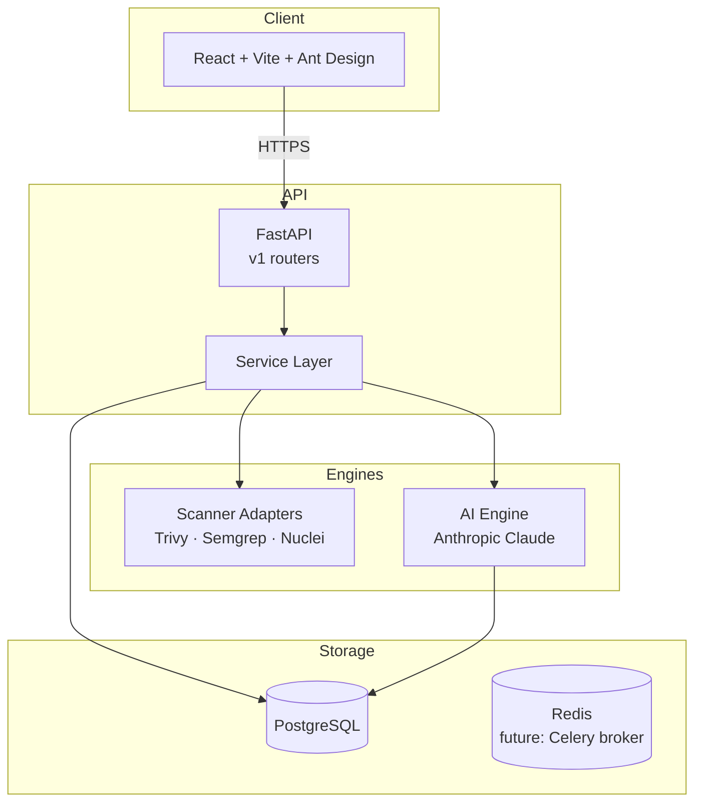

# 🏗️ Mond Architecture

Mond는 작고 명확한 5개 도메인으로 모든 흐름을 표현합니다. 클라우드/스캐너 종속을 어댑터 경계 뒤로 밀어내, 코어는 작고 일반적이며 잘 테스트 가능한 상태를 유지합니다.

## 🌐 시스템 구성



---

## 🧱 5 코어 엔티티

| 엔티티 | 책임 |
|---|---|
| `Asset` | 보호 대상의 단일 진실 공급원 (URI 기반) |
| `Scan` | 1회 스캐너 어댑터 실행 결과 |
| `Finding` | fingerprint로 dedup된 보안 이슈 |
| `Policy` | 룰셋 / 차단 임계치 / 컴플라이언스 매핑 |
| `AIInsight` | Claude가 만든 triage / remediation / explain |

관계:

```
Asset 1 ──< Scan 1 ──< Finding 1 ──< AIInsight
Policy (독립, 평가 시점에 적용)
```

### Fingerprint

`sha256(scanner|rule_id|asset_id|location)`. 동일한 자산에서 동일한 룰이 재발견되면 같은 Finding 행을 갱신해 누적 노이즈를 방지합니다.

---

## 🔌 어댑터 경계

`backend/app/scanners/base.py` — `ScannerAdapter` 추상 클래스. 각 스캐너는:

1. `supports(asset)` — 처리 가능 여부 판정
2. `scan(asset)` — `ScanResult(findings=[RawFinding...], raw_output=...)` 반환
3. 바이너리/원격 API 없을 때 stub 결과 반환 (OSS UX 보장)

`registry.py`에 추가만 하면 UI(Integrations) + API(`/scans` 트리거)에 즉시 등장합니다.

---

## 🤖 AI 엔진

`backend/app/ai/`

- `client.py` — `AsyncAnthropic` 싱글톤. 키 없으면 `None` 반환.
- `insights.py` — `analyze_finding(finding, deep=False)` / `route_query(text)`
  - 시스템 프롬프트가 짧아 **프롬프트 캐싱은 사용하지 않음** (캐시는 1024+ 토큰일 때만 의미).
  - 모델은 항상 strict JSON으로 응답 → 파서가 코드펜스도 허용.
  - 실패 시 기본 규칙 fallback (OSS 사용자 보호).

### Triage 흐름

```
Finding 선택 → POST /api/v1/ai/findings/{id}/triage
  → Claude(haiku 기본 / sonnet --deep) 호출
  → JSON 파싱 → AIInsight 저장
  → 드로어에 summary / recommended_severity / remediation steps 노출
```

---

## 🛡️ 보안 아키텍처

- **인증** — OIDC SSO(Keycloak · Okta · Google) + 서버 세션(opaque token, SHA-256 hash 저장). 즉시 revoke 가능.
- **MFA** — 패스키(WebAuthn/FIDO2) + TOTP + 일회용 백업 코드. `MFA_REQUIRED_ROLES` ENV로 강제 대상 role 지정 (기본 admin·reviewer).
- **인가 (RBAC)** — 4-tier 계층: VIEWER < EMPLOYEE < REVIEWER < ADMIN. `require_role(...)` 의존성으로 엔드포인트별 강제.
- **운영 가드** — `ENVIRONMENT=production` 부팅 시 약한 SECRET_KEY / DEBUG=true / AUTH_MODE=dev / SESSION_SECURE=false 조합을 거부 (config.py `_validate_for_production`).
- **시크릿** — `.env` 기반. 운영은 별도 시크릿 매니저(Vault · AWS Secrets Manager · GCP Secret Manager · External-Secrets Operator) 권장. Helm 차트는 `secrets.existingSecret`로 외부 주입 지원.
- **로그** — `structlog` 구조화 JSON. 운영은 외부 수집기(예: Loki, Elastic) 권장.
- **데이터** — Postgres가 단일 영속 저장소. Redis는 캐시/큐 용도.

---

## 🧪 테스트 / 빌드

```bash
# 백엔드
cd backend && pytest -q

# 프론트
cd frontend && npm run build
```

CI는 `.github/workflows/`에 추가 예정 (현재 골격에서는 비어 있음).

---

## 🧭 확장 포인트

| 영역 | 어떻게 |
|---|---|
| 새 스캐너 | `ScannerAdapter` 구현 + `registry.py` 등록 |
| 새 AI 작업 | `insights.py`에 함수 추가 + 엔드포인트 라우팅 |
| 새 도메인 | `models/` + `schemas/` + `services/` + `api/v1/endpoints/` 4파일 |
| 정책 평가 엔진 | `Policy.definition`을 OPA/Rego, JSON Schema 등으로 해석하는 evaluator 추가 |
| 새 규제 카탈로그 | `app/data/regulations.py`에 `Regulation` + `Scenario` dict 추가 |
| MCP 도구 | `backend/mcp_server.py`에 `@mcp.tool()` 함수 추가 |
| 알림 채널 | `services/notifications.py`의 `notify_finding`에 채널 분기 추가 |

## 🧩 셀프서비스 자동화 흐름

```
GitHub push → /webhooks/github  → Asset 매칭 → trigger_scan
                                    ↓
                                  Finding (dedup by fingerprint)
                                    ↓
                       notify_finding → Slack / Generic webhook
                                    ↓
                       (사용자가 UI에서 "AI 분석 실행")
                                    ↓
                       Claude → AIInsight 저장
```

## 🌐 i18n

- 가벼운 자체 사전 (`frontend/src/i18n/{ko,en}.ts`) + Context Provider.
- antd locale도 함께 토글되어 DatePicker/Pagination 등 위젯도 동기화.
- 백엔드의 Regulations/Reports 엔드포인트는 `?lang=ko|en` 쿼리로 다국어 응답.

## 🤖 MCP

- `backend/mcp_server.py` — FastMCP 기반.
- 도구: `list_assets`, `get_asset`, `list_findings`, `trigger_scan`, `triage_finding`,
  `list_scanners_tool`, `ask`, `regulations_for`, `regulation_detail`.
- stdio entry: `python -m mcp_server` — Claude Desktop/Code 설정에 등록.
- HTTP+SSE: `MCP_HTTP_ENABLED=true`일 때 FastAPI `/mcp` 경로에 마운트.

---

작은 코어, 명확한 어댑터 경계. 확장은 자유롭게.
